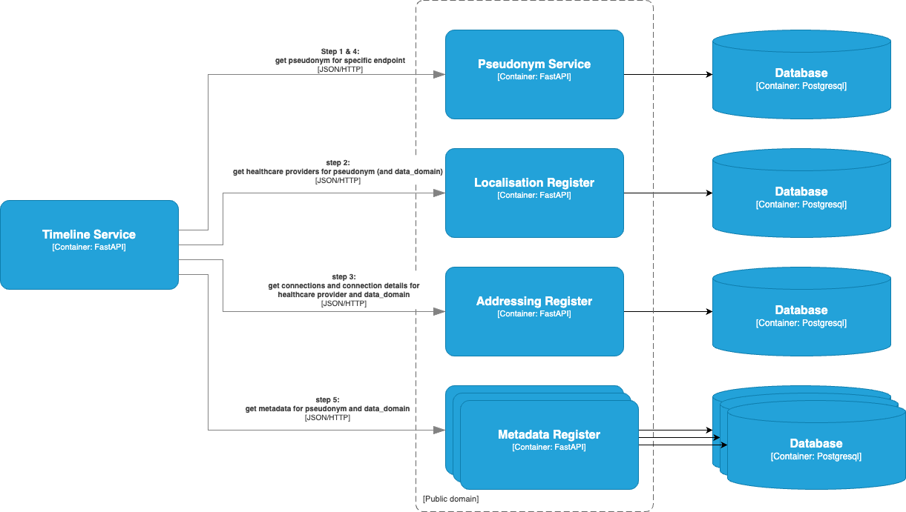

# ZModules

## Disclaimer

The zModules project is currently under development. The information in this repository is 
subject to change. The information in this repository describes the current state of the
various applications.

## Introduction

The zModules project is a collection of applications that have the purpose to improve the
data exchange between healthcare providers.

## Architecture

In this project a Timeline Service is exposed for convenience. It should also be possible
for healthcare applications to connect directly to the underlying services.
When step 5 is finished, a healthcare application can request the actual data using the 
metadata that is fetched in step 5.

