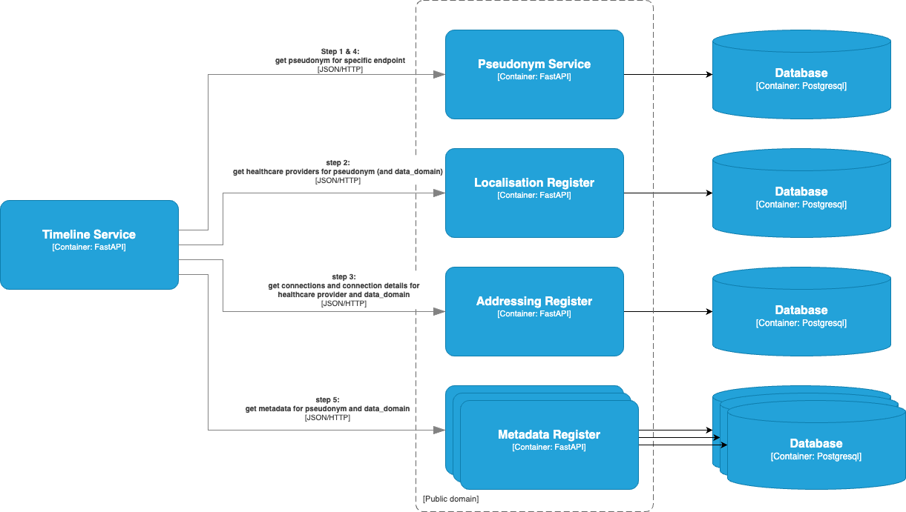

# Generic Functions Modules (Generieke Functies Modules)

## Requirements

- `docker` - Most of the project runs inside of Docker containers
- `php`, `composer` - The [`nl-irealisatie-zmodules-pgo-demo`](https://github.com/minvws/nl-irealisatie-zmodules-pgo-demo)
  project is written in PHP, and requires a package manger. This is being used in the autopilot script.

## Disclaimer

The GFModules project is currently under development. The information in this repository is
subject to change. The information in this repository describes the current state of the
various applications.

## Introduction

The GFModules project is a collection of applications that have the purpose to improve the
data exchange between healthcare providers. This project is the technical implementation of
the various components of the 'Generieke Functies, lokalisatie en addressering' project of the
Ministry of Health, Welfare and Sport of the Dutch goverment.

See the table below for an overview of the currently identified components.

<!-- markdownlint-disable md013 -->
| Project name                                              | Technical component name                                              |
|-----------------------------------------------------------|-----------------------------------------------------------------------|
| GF Localisatie, module Lokalisatie Metadataregister (LMR) | [Localization Metadata Register](#localization-metadata-register-lmr) |
| Module Kwalificatieregister                               |                                                                       |
| GF Lokalisatie, module Lokalisatie register service (LRS) | [Localization Register Service](#localization-register-service-lrs)   |
| GF Lokalisatie, module nationale Verwijsindex (NVI)       | [National Referral Index](#national-referral-index-nri)               |
| GF Lokalisatie, module polymorfe pseudonimisering         | [Pseudonym Service](#pseudonym-service)                               |
| Module Logging                                            |                                                                       |
| GF Addressering                                           | [Addressing Register](#addressing-register)                           |
<!-- markdownlint-enable md013 -->

## Architecture

In this project a Timeline Service is exposed for convenience. It should also be possible
for healthcare applications to connect directly to the underlying services.
When step 5 is finished, a healthcare application can request the actual data using the
metadata that is fetched in step 5.



## Components

### Localization Register Service (LRS)

The Localization Register Service is the aggregate service of the underlying services.

Details about documentation and implementation can be found at the
[Localization Register Service repository](https://github.com/minvws/gfmodules-localization-register-service)

### Pseudonym Service

The Pseudonym Service is responsible for the pseudonymisation of the BSN. Preferably the
BSNk service would be used instead of this service. But because the BSNk is still under
development, the Pseudonym Service is used.

Details about documentation and implementation can be found at the
[Pseudonym Service repository](https://github.com/minvws/nl-irealisatie-zmodules-pseudonym-service)

### National Referral Index (NRI)

The National Referral Index (NRI) is responsible for the referral of the Health Data. The NRI contains a referral
to the register that associates a Health Provider with pseudonym and data domain.

Details about documentation and implementation can be found at the
[National Referral Index repository](https://github.com/minvws/gfmodules-national-referral-index)

### Addressing Register

The Addressing Register holds the information about the various Health Data endpoints that are available
for fetching the metadata. The information of the Addressing Register should be enough for the Timeline
Service or the Health application to fetch the actual metadata.

Details about documentation and implementation can be found at the
[Addressing Register repository](https://github.com/minvws/nl-irealisatie-zmodules-addressing-register)

### Localization Metadata Register (LMR)

The Localization Metadata Register is an addressable register that contains metadata of
all the pseudonyms that it is responsible for. There are multiple metadata registers divided over
the health landscape. In the end, all health data should have corresponding metadata available on one of the available
metadata registers. The Metadata Register endpoints should be described in the Addressing Register.
The LMR should contain entries for all the metadata in the Metadata Register.

The [Localization Metadata Register repository](https://github.com/minvws/gfmodules-localization-metadata-register)
is an example implementation of a LMR. Details about the documentation and implementation
can be found at the repository.

### Qualification Register

For more details about the Qualification Register see [Qualification Register Documentation](qualification-register/qualification-register.md)

## Getting started

If this is the first time you want to set up all the above components you can run:

```sh
tools/./script.sh --autopilot
```

When you want to clear the current state and reinstall everything with the default database migrations you can run:

```sh
tools/./script.sh --remove --clear-config --autopilot --build
```

To setup all the applications you may run the `tools/script.sh` script top setup.

The guides on setting up the individual services to work locally are described in the repositories below.

<!-- markdownlint-disable MD013 -->
| Service       | Exposed http url        | Repository link                                                                                 |
|---------------|-------------------------|-------------------------------------------------------------------------------------------------|
| NRI                     | <http://localhost:8501> | <https://github.com/minvws/gfmodules-national-referral-index>                         |
| Addressing              | <http://localhost:8502> | <https://github.com/minvws/nl-irealisatie-zmodules-addressing-register>               |
| LMR                     | <http://localhost:8503> | <https://github.com/minvws/gfmodules-localization-metadata-register>                  |
| Pseudonym               | <http://localhost:8504> | <https://github.com/minvws/nl-irealisatie-zmodules-pseudonym-service>                 |
| LRS                     | <http://localhost:8505> | <https://github.com/mInvws/gfmodules-localization-register-service>                   |
| Qualification Admin API | <http://localhost:8506> | <https://github.com/minvws/nl-irealisatie-zmodules-qualification-register-admin-api>  |
| Qualification API       | <http://localhost:8507> | <https://github.com/minvws/nl-irealisatie-zmodules-qualification-register-api>        |
| Qualification Web       | <http://localhost:8508> | <https://github.com/minvws/nl-irealisatie-zmodules-qualification-register-web>        |

## Contributing

### Usage of `.gitignore` files
It is important to leave user specific files such as IDE or text-editor settings outside the repository. For this, create an local `.gitignore` file and configure git like below.

```bash
git config --global core.excludesfile ~/.gitignore
```

## Documentation

When introducing changes in the documenation, the `node` and [`markdownlint-cli2`](https://github.com/DavidAnson/markdownlint-cli2) tool can both come in handy. These are being [used in the continuous integration (CI) pipeline](.github/workflows/documentation-linter.yml) to lint all the Markdown files. Therefor you can use the `markdownlint-cli2` tool on the Markdown files to check and fix the style.
