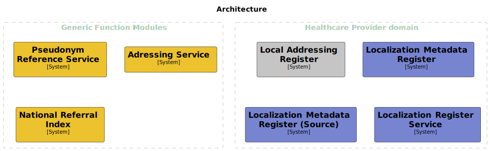

# Generic Functions Modules (Generieke Functies Modules)

## Requirements

- `docker` - Most of the project runs inside of Docker containers.

## Disclaimer

This project and all associated code serve solely as **documentation and demonstration purposes**
to illustrate potential system communication patterns and architectures.

This codebase:

- Is NOT intended for production use
- Does NOT represent a final specification
- Should NOT be considered feature-complete or secure
- May contain errors, omissions, or oversimplified implementations
- Has NOT been tested or hardened for real-world scenarios

The code examples are *only* meant to help understand concepts and demonstrate possibilities.

By using or referencing this code, you acknowledge that you do so at your own risk and that
the authors assume no liability for any consequences of its use.

## Introduction

The GFModules project is a collection of applications aimed at improving data exchange between
healthcare providers, the target audience for this initiative.
The project is the technical implementation of the various components of the 'Generieke Functies,
lokalisatie en addressering' project of the Ministry of Health, Welfare and Sport of the Dutch government.
All components pertain to PoC level implementation.

## Architecture

This project supplies a number of generic components that should be used in the Generic Functions Localization and
Addressing. Aside from the generic components, this project also supplies a reference implementation for various
components to make integration easier.




## Processes

This project supports multiple processes. To give a clear overview they are divided into read, write and administration processes.

### Read

- [Fetch localization information about health data](./docs/processes/localize_health_data.md)
- [Find endpoints of healthcare services [mCSD ITI-90]](./docs/processes/find_endpoints.md)
- [Fetch metadata from Metadata Register [FHIR resources]](./docs/processes/metadata_fhir.md)
- [Fetch timeline](./docs/processes/timeline.md)
- Find qualified healthcare services

### Write

- [Update localization from metadata register at referral index](./docs/processes/update_localization_data.md)

### Administration

- [Update addressbook reference at addressing register](./docs/processes/update_addressbook_reference.md)
- [Update addresses from addressbook [mCSD ITI-91]](./docs/processes/update_addresses_addressbook.md)
- Update qualified healthcare services

## Components

### Localization Register Service (LRS)

The Localization Register Service is the aggregate service of the underlying services.

Details about documentation and implementation can be found at the
[Localization Register Service repository](https://github.com/minvws/gfmodules-localization-register-service)

### Pseudonym Service

The Pseudonym Service is responsible for the pseudonymisation of the BSN. Preferably the
BSNk service would be used instead of this service. But because the BSNk is still under
development, the Pseudonym Service is used.

Details about documentation and implementation can be found at the
[Pseudonym Service repository](https://github.com/minvws/gfmodules-pseudonym-stub)

### National Referral Index (NRI)

The National Referral Index (NRI) is responsible for the referral of the Health Data. The NRI contains a referral
to the register that associates a Health Provider with pseudonym and data domain.

Details about documentation and implementation can be found at the
[National Referral Index repository](https://github.com/minvws/gfmodules-national-referral-index)

### Addressing Register

The Addressing Register holds the information about the various Health Data endpoints that are available
for fetching the metadata. The information of the Addressing Register should be enough for the Timeline
Service or the Health application to fetch the actual metadata.

All the data models available in the Addressing Register are based on [HL7 FHIR R4](https://hl7.org/fhir/R4/)

Details about documentation and implementation can be found at the
[Addressing Register repository](https://github.com/minvws/gfmodules-addressing-register)

### Localization Metadata Register (LMR)

The Localization Metadata Register is an addressable register that contains metadata of
all the pseudonyms that it is responsible for. There are multiple metadata registers divided over
the health landscape. In the end, all health data should have corresponding metadata available on one of the available
metadata registers. The Metadata Register endpoints should be described in the Addressing Register.
The LMR should contain entries for all the metadata in the Metadata Register.

The [Localization Metadata Register repository](https://github.com/minvws/gfmodules-localization-metadata-register)
is an example implementation of a LMR. Details about the documentation and implementation
can be found at the repository.

### Qualification Register

For more details about the Qualification Register see [Qualification Register Documentation](qualification-register/qualification-register.md)

## Getting started

If this is the first time you want to set up all the above components you can run:

```sh
tools/./script.sh --autopilot
```

When you want to clear the current state and reinstall everything with the default database migrations you can run:

```sh
tools/./script.sh --remove --clear-config --autopilot --build
```

To setup all the applications you may run the `tools/script.sh` script top setup.

The guides on setting up the individual services to work locally are described in the repositories below.

<!-- markdownlint-disable MD013 -->
| Service       | Exposed http url        | Repository link                                                                                 |
|---------------|-------------------------|-------------------------------------------------------------------------------------------------|
| NRI                     | <http://localhost:8501> | <https://github.com/minvws/gfmodules-national-referral-index>                         |
| Addressing              | <http://localhost:8502> | <https://github.com/minvws/gfmodules-addressing-register>                             |
| LMR                     | <http://localhost:8503> | <https://github.com/minvws/gfmodules-localization-metadata-register>                  |
| Pseudonym               | <http://localhost:8504> | <https://github.com/minvws/gfmodules-pseudonym-stub>                                  |
| LRS                     | <http://localhost:8505> | <https://github.com/mInvws/gfmodules-localization-register-service>                   |
| Qualification Admin API | <http://localhost:8506> | <https://github.com/minvws/gfmodules-qualification-register-admin-api>                |
| Qualification API       | <http://localhost:8507> | <https://github.com/minvws/gfmodules-qualification-register-api>                      |
| Qualification Web       | <http://localhost:8508> | <https://github.com/minvws/gfmodules-qualification-register-web>                      |

## Contributing

### Usage of `.gitignore` files

It is important to leave user specific files such as IDE or text-editor settings outside the repository. For this, create an local `.gitignore` file and configure git like below.

```bash
git config --global core.excludesfile ~/.gitignore
```

When you run into issues when running the project locally, please submit the debug.log file that can be generated by running:

```bash
tools/./script.sh --debug
```

## Documentation

When introducing changes in the documentation, the `node` and [`markdownlint-cli2`](https://github.com/DavidAnson/markdownlint-cli2) tool can both come in handy. These are being [used in the continuous integration (CI) pipeline](.github/workflows/documentation-linter.yml) to lint all the Markdown files. Therefor you can use the `markdownlint-cli2` tool on the Markdown files to check and fix the style.

### Structurizr

The images in [docs/images](./docs/images/) are created from the structurizr [workspace.dsl](./docs/workspace.dsl) file.
To update the images after changing the structurizr workspace file run the following command:

```bash
tools/./update-diagrams.sh
```
