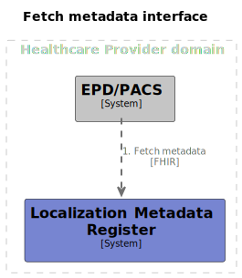

# Interface Specification Localization Metadata Register - Fetch metadata [FHIR]

## Disclaimer

The GFModules project is currently under development. The information in this interface description is
subject to change.

## Context

The GFModules project is a collection of applications that have the purpose of improving data exchange process between
healthcare providers. The project is the technical implementation of various components of the 'Generieke Functies,
lokalisatie en addressering' project of the Ministry of Health, Welfare and Sport of the Dutch government.

The Localization Metadata Register(LMR) is a component that should be provided or delegated by all healthcare
providers. The LMR should provide metadata for a certain RID that is linked to a BSN in the LMR.

This interface description can be found at the [github repository](https://github.com/minvws/gfmodules-coordination/tree/main/docs/interface-definitions).

<div style="page-break-after: always;"></div>

## Summary

This interface enables applications in the Healthcare Provider domain to fetch metadata for a patient based on the RID
which is retrieved from the PRS. (see [Process](#process)). This interface is build on the
[HL7 FHIR Release 4](https://hl7.org/fhir/r4/) specification. The addition specified in this interface
definition is the possibility to search for healthdata based on a RID.



<div style="page-break-after: always;"></div>

## Process

This interface is used in the following processes:

- [Fetch Metadata](../processes/metadata_fhir.md)

## Authentication

All endpoints that are described here are only accessible behind mTLS with a valid UZI Server Certificate.

## Endpoints

The LMR should set the display value of all linked resources to present all required information for
the healthcare professional without the need of sequential queries to the LMR.

Dependend on the domain, the LMR should provide a search on RID on the following endpoints:

- [ImagingStudies (Beeld)](#imagingstudies-beeld)

<div style="page-break-after: always;"></div>

### ImagingStudies (Beeld)

The LMR should provide a search on the [ImagingStudy](https://hl7.org/fhir/r4/imagingstudy.html) FHIR resource with the
RID as an extra property to filter on.

<!-- markdownlint-disable MD013 -->
|  |  |
|---|---|
| Path | http{s}://server{/path}/ImagingStudy/_search |
| Type | GET |
| Query Parameters | [Pseudonym](#pseudonym) |
| JSON payload | |
| Response codes | 200, 422 |
<!-- markdownlint-enable MD013 -->

Example CURL request:

```curl
curl -X 'POST' \
  'https://server/resource/ImagingStudy/_search?pseudonym=<<pseudonym>>' \
  -H 'accept: application/json' \
  -H 'Content-Type: application/json'
}'
```

Example response:

```json
{
  "resourceType": "Bundle",
  "id": "37659c25-11b6-41ac-ae2d-213636f374ef",
  "type": "searchset",
  "total": 6,
  "entry": [
    {
      "resource": {
        "resourceType": "ImagingStudy",
        "id": "83479c26-a5ec-4a79-96b9-e721585ddcc9",
        "identifier": [
          {
            "system": "http://example.org/study",
            "value": "83479c26-a5ec-4a79-96b9-e721585ddcc9"
          }
        ],
        "status": "registered",
        "subject": {
          "reference": "Patient/fe3344a9-29a5-4897-b1ba-24c1e0c5ee49",
          "display": "Sten Timmermans"
        },
        "started": "2021-06-19T07:17:35.741755",
        "numberOfSeries": 1,
        "series": [
          {
            "uid": "67256967-0a44-4dc6-8155-91ab9ccd1538",
            "number": 0,
            "modality": {
              "coding": [
                {
                  "system": "http://example.org/modality",
                  "code": "US",
                  "display": "Ultrasound"
                }
              ]
            },
            "bodySite": {
              "concept": {
                "coding": [
                  {
                    "system": "http://example.org/body-site",
                    "code": "pelvis",
                    "display": "Bekken"
                  }
                ]
              }
            },
            "started": "2023-07-27T18:00:18.376874",
            "performer": [
              {
                "actor": {
                  "reference": "Practitioner/3137b5e0-9688-43b8-b9f2-b0ab70c50f9d",
                  "type": "Practitioner",
                  "display": "Dokter Bibber"
                }
              }
            ],
            "instance": [
              {
                "uid": "98f284cb-bdd4-40a3-ab20-39291c853272",
                "sopClass": {
                  "system": "http://example.org/sop-class",
                  "code": "DX",
                  "display": "Digital Radiography"
                },
                "number": 0,
                "title": "Knie kans schreeuwen gaan rok vroeger gelijk."
              }
            ]
          }
        ]
      }
    },
    {
      "resource": {
        ...
      }
    },
    {
      ...
    }
  ]
}
```

#### Pseudonym

A pseudonym send as a query parameter or as a json property is always serialized as a string

TODO: Update pseudonym to RID when PRS implementation is finished

## Discussions

### Restrict returned properties of resource

To maximise the privacy of the patients the LMR should only return the properties that are defined in this interface
definition which are required to give the healthcare professional enough metadata to have an idea about the information
that is stored in the actual data storage.

### Restrict other requests to metadata Register

Should the LMR also restrict requests to other (FHIR) endpoints of the LMR that are not required for requesting
metadata?

When a source register also acts as a metadata register it is maybe difficult to set such restrictions for requests
only for the LMR feature of a source register.
