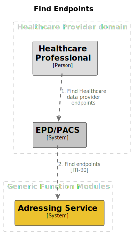
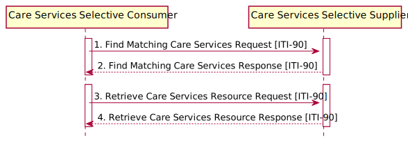

# Interface Specification Addressing Register - Find Endpoints [ITI-90]

## Disclaimer

This project and all associated code serve solely as **documentation and demonstration purposes**
to illustrate potential system communication patterns and architectures.

This codebase:

- Is NOT intended for production use
- Does NOT represent a final specification
- Should NOT be considered feature-complete or secure
- May contain errors, omissions, or oversimplified implementations
- Has NOT been tested or hardened for real-world scenarios

The code examples are *only* meant to help understand concepts and demonstrate possibilities.

By using or referencing this code, you acknowledge that you do so at your own risk and that
the authors assume no liability for any consequences of its use.

## Context

The GFModules project is a collection of applications that have the purpose of improving data exchange process between
healthcare providers. The project is the technical implementation of various components of the 'Generieke Functies,
lokalisatie en addressering' project of the Ministry of Health, Welfare and Sport of the Dutch government.

The Addressing Register holds information about various Health Data endpoints that are available for fetching the
metadata. The information of the Addressing Register should be enough for the Timeline Service or the Health
application to fetch the actual metadata.

This interface description can be found at the [github repository](https://github.com/minvws/gfmodules-coordination/tree/main/docs/interface-definitions).

<div style="page-break-after: always;"></div>

## Summary

This interface enables applications in the Healthcare Provider domain to fetch Health Data endpoints (see[Process](#process)).
This interface is build on the [HL7 FHIR Release 4](https://hl7.org/fhir/r4/) specification in combination with the
 [mCSD extension for the ITI-90 profile](https://profiles.ihe.net/ITI/mCSD/ITI-90.html).



<div style="page-break-after: always;"></div>

## Process

This interface is used in the following processes:

- [Find Endpoints](../processes/find_endpoints.md)

## Authentication

All endpoints that are described here are only accessible behind mTLS.

## Finding Endpoints

Finding Health Data endpoints is a two step process based on the
[mCSD extension for the ITI-90 profile](https://profiles.ihe.net/ITI/mCSD/ITI-90.html) where the first step involves
retrieving a FHIR bundle of Organization resources from the Addressing Register based on query parameters, and secondly
retrieves an Endpoint FHIR Resource that contains the addresses belonging to that specific Organizations.

The protocol is shown in the image below, the Consumer is the application that wants to fetch the metadata from the
Health Data endpoint and the Provider is the Addressing Register.



Depending on which step of the process is being executed, the following endpoints are available:

- [Organization (step 1)](#organization)
- [Endpoint (step 3)](#endpoint)

<div style="page-break-after: always;"></div>

### Organization

The Organization endpoint is used to retrieve a bundle of Organization resources from the Addressing Register based on query
parameters. The parameters as defined in
[ITI-90](https://profiles.ihe.net/ITI/mCSD/ITI-90.html#23904122-organization-resource-message-semantics) are used to
filter Organizations that are then returned in a Bundle.

<!-- markdownlint-disable MD013 MD037 -->
|  |  |
|---|---|
| Path | http{s}://server{/path}/Organization |
| Type | GET |
| Query Parameters | _id, _lastUpdated, active, identifier, name, partOf, type, _include, _revInclude |
| JSON payload | |
| Response codes | 200, 422 |
<!-- markdownlint-enable MD013 MD037 -->

Example CURL request:

```curl
curl -X 'GET' \
  'http://localhost:8502/Organization?active=True&name=sample_org&type=govt&_include=Organization.endpoint' \
  -H 'accept: application/json'
```

Example response:

```json
{
  "resourceType": "Bundle",
  "type": "searchset",
  "total": 1,
  "entry": [
    {
      "resource": {
        "resourceType": "Organization",
        "identifier": [
          {
            "use": "usual",
            "value": "5816461b-646a-45a7-be39-280f17cd82c8"
          },
          {
            "use": "official",
            "value": "78001448"
          }
        ],
        "active": true,
        "type": [
          {
            "coding": [
              {
                "code": "govt",
                "display": "Government"
              }
            ],
            "text": "type of organization"
          }
        ],
        "name": "Mol BV",
        "endpoint": [
          {
            "reference": "Endpoint/2507f188-9f3a-4149-a2b2-ffd99be303ad"
          }
        ]
      }
    }
  ]
}
```

### Endpoint

The Endpoint endpoint is used to retrieve a list of Endpoint resources from the Addressing Register based on query
parameters. The parameters as defined in
[ITI-90](https://profiles.ihe.net/ITI/mCSD/ITI-90.html#23904128-endpoint-resource-message-semantics) are used to
filter Endpoints that are then returned in a Bundle.

<!-- markdownlint-disable MD013 MD037-->
|  |  |
|---|---|
| Path | http{s}://server{/path}/Endpoint |
| Type | GET |
| Query Parameters | _id, _lastUpdated, identifier, organization, status |
| JSON payload | |
| Response codes | 200, 422 |
<!-- markdownlint-enable MD013 MD037-->

Example CURL request:

```curl
curl -X 'GET' \
  'http://localhost:8502/Endpoint?organization=5816461b-646a-45a7-be39-280f17cd82c8' \
  -H 'accept: application/json'
```

Example response:

```json
{
  "resourceType": "Bundle",
  "type": "searchset",
  "total": 1,
  "entry": [
    {
      "resource": {
        "resourceType": "Endpoint",
        "identifier": [
          {
            "use": "usual",
            "value": "2507f188-9f3a-4149-a2b2-ffd99be303ad"
          }
        ],
        "status": "error",
        "connectionType": {
          "code": "dicom-wado-rs",
          "display": "DICOM WADO-RS"
        },
        "name": "Dan grens op leven.",
        "managingOrganization": {
          "reference": "Organization/78001448"
        },
        "contact": [
          {
            "system": "fax",
            "value": "Over anders eenheid voeden.",
            "use": "temp",
            "rank": "3",
            "period": {
              "start": "2020-09-29T16:53:01.128919",
              "end": "2022-09-01T15:16:09.077672"
            }
          }
        ],
        "payloadType": [
          {
            "coding": [
              {
                "code": "any",
                "display": "ANY"
              }
            ],
            "text": "type of the payload for the endpoint"
          }
        ],
        "payloadMimeType": [
          "application/xop+xml"
        ],
        "address": "http://www.oennen.com/",
        "header": [
          "Meest dichtbij klasse min verandering."
        ]
      }
    }
  ]
}
```
