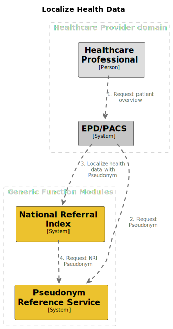

# Localize health data

## Summary

This process enables healthcare professionals to use their EPD to localize the health data of a certain patient based
on their BSN.

## Process overview

Diagram of the overview

## Interface definitions

2\. TODO: Request RID

[3\. Localize health data with RID](https://github.com/minvws/gfmodules-national-referral-index/blob/main/docs/interface-definitions/lookup.md)

4\. TODO: Request base pseudonym
