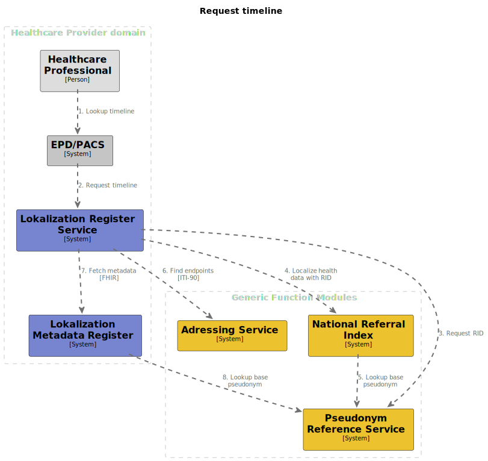

# Request timeline

## Summary

Request timeline is the process of fetching patient's data, and aggregating them into a cohesive set. The data is a
representation of the patient's medical history. The proposed process involves internal and external communications of
the GFModules stack. All done while maintaining anonymity of the patient throughout the flow.

## Process overview

Overview diagram of the process

## Interface definitions

2\. [Request timeline](https://github.com/minvws/gfmodules-localization-register-service/blob/main/docs/interface-definitions/request-timeline.md)

3\. TODO: Request Pseudonym

[4\. Localize health data with Pseudonym](https://github.com/minvws/gfmodules-national-referral-index/blob/main/docs/interface-definitions/lookup.md)

5\. TODO: Lookup NRI Pseudonym

[6\. Find endpoints [ITI-90]](../interface-definitions/find-endpoints.md)

[7\. Fetch metadata [FHIR]](../interface-definitions/fetch-metadata.md)

8\. TODO: Lookup LMR Pseudonym
