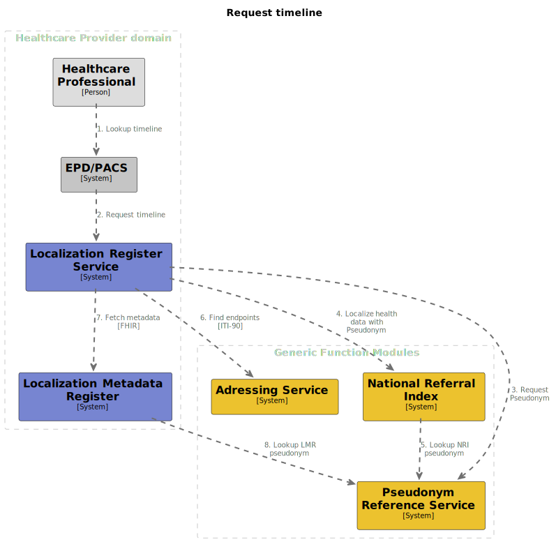

# Request timeline

## Summary

Request timeline is the process of fetching patient's data, and aggregating them into a cohesive set. The data is a
representation of the patient's medical history. The proposed process involves internal and external communications of
the GFModules stack. All done while maintaining anonymity of the patient throughout the flow.

## Process overview

Overview diagram of the process

## Interface definitions

2\. [Request timeline](https://github.com/minvws/gfmodules-localization-register-service-private/blob/docs/timeline-service/docs/interface-definitions/request-timeline.md)

3\. TODO: Request RID

[4\. Localize health data with RID](https://github.com/minvws/gfmodules-national-referral-index/blob/main/docs/interface-definitions/lookup.md)

5\. TODO: Lookup base pseudonym

6\. TODO: Find endpoints

7\. TODO: Fetch metadata [FHIR]

8\. TODO: Lookup base pseudonym
