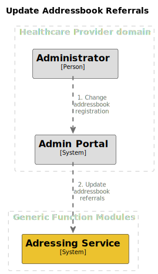

# Update addressbook referrals

## Summary

This process enables organisations to update their reference to their addressbook (Local Addressing Service) in the
addressing service.

## Process overview

## Interface definitions

2\. TODO: Update addressbook referrals

## Open questions

### How are we identifying an administrator?

An administrator doesn't necessary have an UZI/DEZI identity.

### What flow are we going to support for IT parties which are not part of the healthcare organisation itself?

It's very likely that there will be Healthcare organisations which are outsourcing there adminstration to an IT party.
