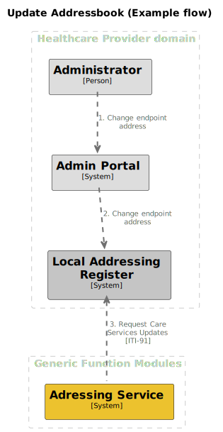

# Update addresses addressbook

## Summary

This process enables healthcare providers to manage the addresses that are stored in their referenced addressbook.

## Process Overview

The flow below shows how the update process could work when the healthcare provider has an admin portal to manage their
own endpoint information.

## Interface definitions

1\. TODO: Request Care Services Updates [ITI-91]

## Open questions

### How are we identifying an administrator?

An administrator doesn't necessary have an UZI/DEZI identity.

### What flow are we going to support for IT parties which are not part of the healthcare organisation itself?

It's very likely that there will be Healthcare organisations which are outsourcing there adminstration to an IT party.
