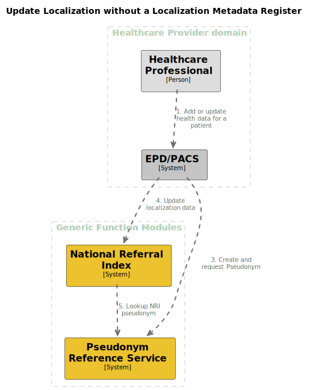

# Update localization data

## Summary

This process enables Healthcare Professionals to add or update a referral to a certain metadata register or source register.

## Process overview

## Interface definitions

3\. TODO, update interface definition reference

4\. TODO: update interface definition reference Update localization data

5\. TODO, update interface definition reference

## Open questions

### How are we going to remove data from disconnected parties?

When for example a healthcare organization goes bankrupt, we need to have a system in place that clears al the
referrals for that organization.
