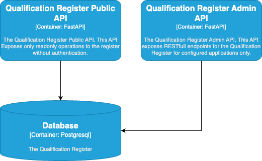

# Qualification Register

## Introduction

The qualification register makes it possible to make a selection of healthcare providers
who are qualified for specific information standards. This can be used as a step in the
localization process to make an initial selection of where information about a patient
for a specific care context, also called the exchange, can be found.

The qualification register is not part of GFModules main stack. Yet, it sits
in the background for further explorations at later stages.

## Disclaimer

This project and all associated code serve solely as **documentation and demonstration purposes**
to illustrate potential system communication patterns and architectures.

This codebase:

- Is NOT intended for production use
- Does NOT represent a final specification
- Should NOT be considered feature-complete or secure
- May contain errors, omissions, or oversimplified implementations
- Has NOT been tested or hardened for real-world scenarios

The code examples are *only* meant to help understand concepts and demonstrate possibilities.

By using or referencing this code, you acknowledge that you do so at your own risk and that
the authors assume no liability for any consequences of its use.

## Design

The qualification register is split up in two main parts:

- The register
- The administration portal

The current setup only supplies an API for a future portal to be built.
The API including the database model and documentation can be found at the
[qualification-register](https://github.com/minvws/gfmodules-qualification-register-admin-api)
repository.

